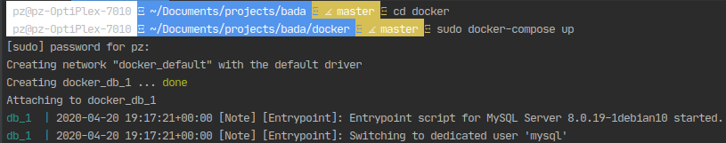
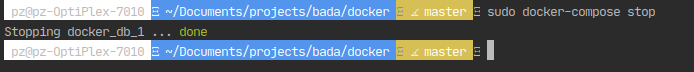
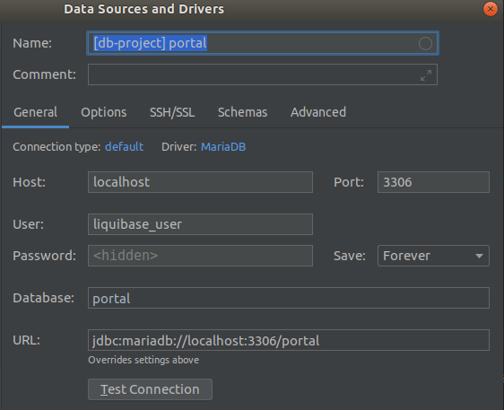
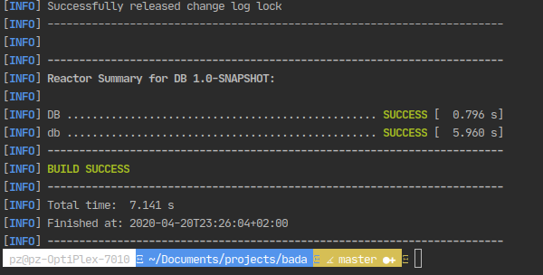
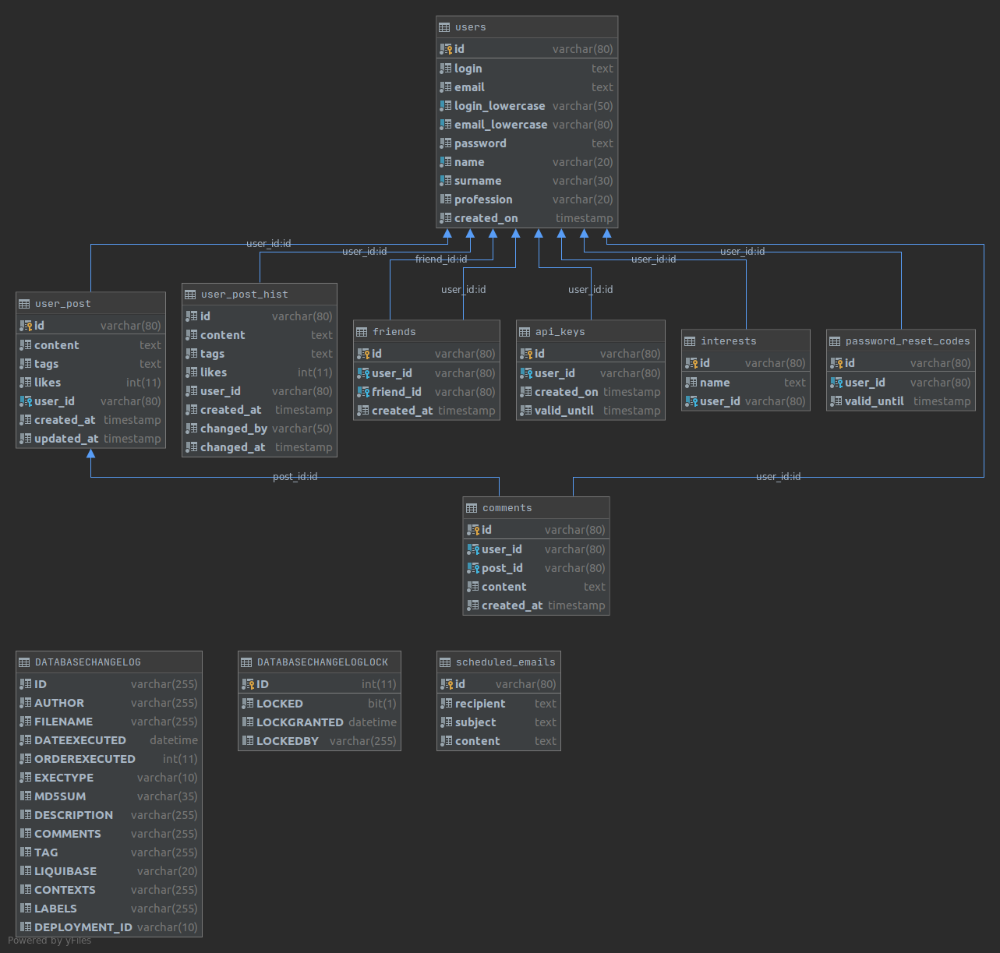

## Getting started

Prerequists:
- [Docker Desktop](https://www.docker.com/products/docker-desktop) with [DockerCompose](https://docs.docker.com/compose/)
- [Maven](http://maven.apache.org/)
- java 1.8 (maven adn liquibase requirements)

**Important** The docker on Windows work only on Professional and Ultimate version due to not 
supported Hyper-V technology on Windows Home Edition

After installation Docker Desktop and DockerComposer go to terminal and change directory to [./docker](./docker)
```bash
cd docker
```
Then run docker container

Linux
```bash
sudo docker-compose up
```
Mac OS
```bash
docker-compose up
```



Stopping docker:
Linux
```bash
sudo docker-compose stop
```

Mac OS
```bash
sudo docker-compose stop
```



**Important** to allow stop container all connections to DB must be closed!

### Connections
Connection parameters:


The username and password are taken from [docker-compose.yml](./docker/docker-compose.yml)
under `MYSQL_USER` and `MYSQL_PASSWORD`. Default username for MariaDb is  `root`
The URL is standard MySql jdbc URL `jdbc:mariadb://localhost:3306/portal` and connect to database created 
on start with name provided as `MYSQL_DATABASE`. For more [Docker Hub MariaDB](https://hub.docker.com/_/mariadb)
under **Environment Variables**

### Migrations

As the migration tool is chosen [Liquibase](https://www.liquibase.org/) 

To start migration run:

```bash
mvn -f pom.xml resources:resources liquibase:clearCheckSums liquibase:update -Plocal -Dschema='<schema_name>' -X
```
As result should appear similar log

`mvn -f pom.xml resources:resources liquibase:clearCheckSums liquibase:update -Plocal -Dschema='portal'`



As RDBMS recomendation is: [DataGrip](https://www.jetbrains.com/datagrip/)

### The project is part of learning SQL language

The database portal represent simple social network application 


